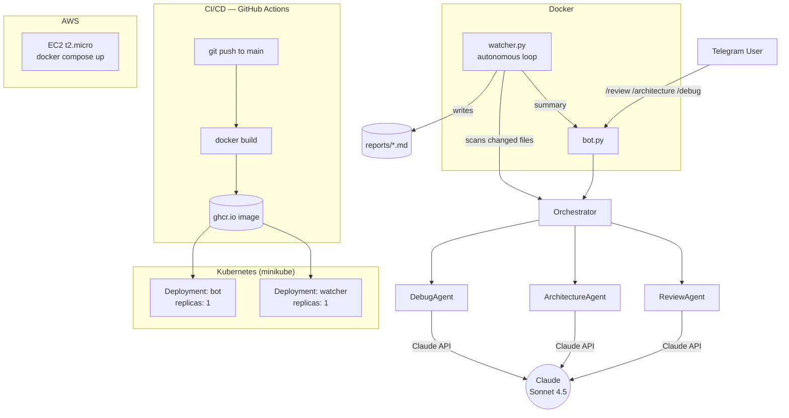

# RepoRadar

A small multi-agent system where Claude reviews code from three angles —
architecture, bugs, and general style — reachable from Telegram, and watched
over by an autonomous agent that scans code on its own. Built to learn
LangChain, Docker, AWS, Kubernetes, and CI/CD end to end, not just read about them.

## Architecture



## Components

| File | Role |
|---|---|
| `agents/review_agent.py` | General code review — bugs, style, risks |
| `agents/architecture_agent.py` | Structural / design-level review |
| `agents/debug_agent.py` | Diagnoses code + error → root cause + fix |
| `orchestrator.py` | Single entry point, routes by `task_type` |
| `bot.py` | Telegram interface, chat-ID authorization gate |
| `watcher.py` | Autonomous agent — polls a folder, reviews changed files, writes reports |
| `Dockerfile` / `docker-compose.yml` | One image, two services (bot, watcher) |
| `.github/workflows/ci.yml` | Builds and publishes the image to ghcr.io on every push to `main` |
| `k8s/` | Namespace, Deployments, Secret template for running on minikube |
| `deploy/aws/README.md` | Step-by-step EC2 deployment instructions |

## Quickstart (local)

```bash
python -m venv .venv
.venv\Scripts\Activate.ps1        # Windows
pip install -r requirements.txt
# fill in .env with ANTHROPIC_API_KEY, TELEGRAM_BOT_TOKEN, TELEGRAM_AUTHORIZED_CHAT_ID
python cli.py                      # quick agent test, no Telegram needed
```

## Run with Docker

```bash
docker compose up
```

## Deploy to AWS

See [`deploy/aws/README.md`](deploy/aws/README.md) for full EC2 setup steps.

## Orchestrate with Kubernetes (minikube)

```bash
minikube start
kubectl apply -f k8s/namespace.yaml
kubectl create secret generic reporadar-secrets --from-env-file=.env --namespace=reporadar
kubectl apply -f k8s/deployment.yaml
kubectl get pods -n reporadar
kubectl logs -n reporadar deployment/reporadar-watcher
```

## Design decisions

- **LangChain here, not LangGraph** — this is a separate learning project from
  my main product (which uses LangGraph); LangChain's simpler chain model fit
  a small, stateless multi-agent setup better and was faster to learn from scratch.
- **Long polling, not webhook, for the Telegram bot** — no public HTTPS
  endpoint needed, simpler to run behind NAT / on a bare EC2 instance. Trade-off:
  doesn't scale past one instance, which is why the bot's K8s Deployment is
  pinned to `replicas: 1` — two pollers on the same token would conflict.
- **EC2 + Docker Compose over ECS/Lambda** — Free Tier friendly, and the
  workload (long-running polling process) doesn't fit a Lambda's execution model.
- **minikube over EKS** — no ongoing cost, same manifests would apply to a real
  cluster with only the image registry auth changing.
- **`PYTHONUNBUFFERED=1`** — without it, container logs from `print()` don't
  appear in real time; found this the hard way when `kubectl logs` came back
  empty on a healthy, running pod.
- **Only one live instance of the bot at a time** — hit this in practice: with
  the bot running simultaneously on a local Docker container, on Kubernetes,
  and on EC2, Telegram returned `409 Conflict` on `getUpdates` (only one poller
  per token is allowed). Fixed by scaling the K8s bot deployment to 0 replicas
  and keeping AWS as the single live instance — a direct, hands-on illustration
  of why the bot's Deployment is pinned to `replicas: 1`.
## What I'd do with more time

- Move the Telegram bot to webhook mode for real horizontal scaling
- Add a small test suite for the orchestrator's routing logic
- Move from EC2 to ECS Fargate for the AWS side